* 极客时间 - 技术管理36讲 - 刘建国

* 角色认知:
  * 认可管理的价值、享受管理带来的成长、对管理的热爱
* 看方向
  * 团队规划：职能->目标->团队->路径
* 带人
  * 团队建设：能力->激励->分工>协作->梯队->文化
* 做事
  * 任务管理：轻重缓急->有效执行->流程机制 
* 管理沟通
  * 个人战斗力 = “能力” * “意愿”
  * 怎么提升能力：推、拉、放手
  * 怎么提升意愿：你怎么做成员激励的「从马斯洛需求层次/丹尼尔驱动力3.0模型，生存/安全->服从(渴望奖励，避免惩罚)->自驱(自主、专精、使命和价值)」
  * 老员工（角色->认同->支持->约束）
  * 刺头员工（团队<->做事，破坏性<->建设性 四象限 评估）
* 团队职责：商品信息管理系统的维护
* 团队使命：解放商品管理劳动力
* 怎么提升凝聚力？
  * 共同(愿景) 提升(归属，事对/人对/味对) 加强(了解) 面对(挑战)
* 怎么保持技术能力不退化？
  * 从coding能力转变为技术判断力
  * 通过定期技术分享、听取汇报、与技术专家交流、寻求指导
* Member和Leader最大的区别是什么？
  * Member注重当前，Leader注重远方；
  * Member注重个人成长，Leader注重团队成长
* Leader类型：有指令型、支持型、教练型、授权型 等类型的风格，我属于教练型->授权型之间
* 当你去一个新团队，你要做些什么
  * 上下沟通，左右看看，建立信任（承诺+专业+大牛站台）

--------

* 技术管理
> 1. 做技术和带团队，更像是职业发展的两条腿，而不是完全叉开的两条路。 
> 2. 管理到底都需要做哪些事呢？
> 3. 怎么做团队建设呢？
> 4. 怎么提升团队凝聚力呢？
> 5. 怎么做向上沟通和向上管理？ 
> 6. 怎么做员工激励？
> 7. 怎么应对低绩效员工呢？ 
> 8. 技术类分两个方向（广和专） 
> 9. 管理类（技术管理者， 职业经理人） 
> 10. 创业类（创始人 / 技术合伙人头条（T）的杨震原、美团（M）的穆荣均、滴滴（D）的张博）
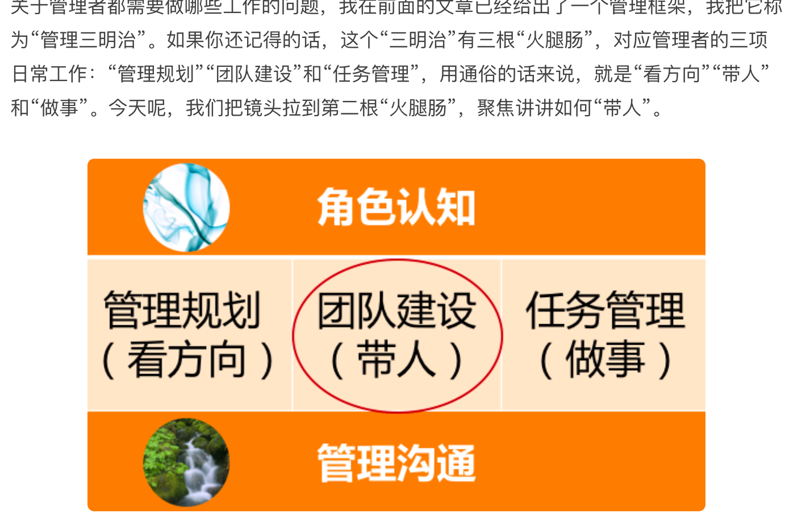
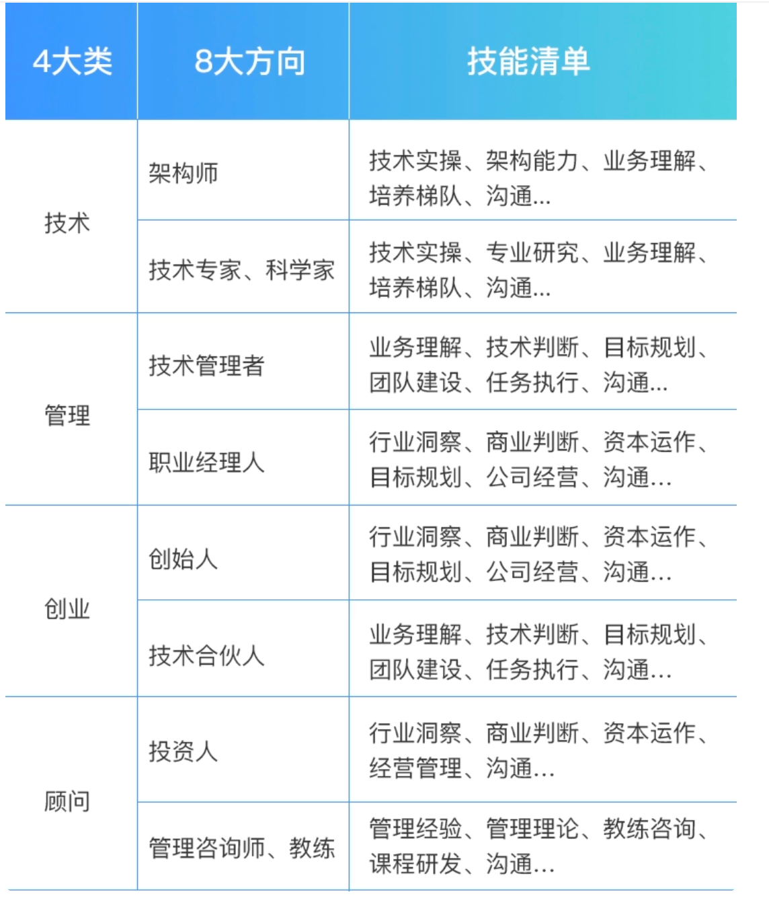

* 你所有的职业发展，都会围绕着技术和管理这两条腿在走路，一条腿是走不远的。

* 做管理对你来说意味着什么呢？你觉得它能给你带来什么？
  * 不得已选择，别人眼里的成功，不辜负组织期待，对管理的主管遐想？？？这些都是外驱力
  * 内在动力和真正诉求：
    * 你是否认可管理的价值？
    * 认为招聘面试、辅导员工、向上汇报、开会沟通、流程梳理、资源协调、进度推动、绩效评估等大部分管理工作，都是琐碎的“杂事”，很难从这些工作中获得价值感和成就感，甚至还对于这些工作挤占了写代码的时间而不满。
    * 认为经理是给高工和架构师打下手的，职责就是支持好架构师的工作，所以比较郁闷。
    * 认为管理的工作不如技术工作有价值，通过技术手段来解决问题才是最酷的事情。
  * 你是否对管理充满热情，并享受这些工作呢？
  * 你是否主动地向自己的上级了解过团队的工作目标呢？你是否主动关心过新同事该怎么培养，以及如何更好地帮助他们成长呢？你是否享受去负责一个大项目的协调和推进？它的成功发布是否会给你带来强烈的成就感呢？你是否思考过什么样的流程和机制可以应对团队工作中的那些疏漏呢？
  * 你是否看重在管理方面的成长呢？

* 如果说你前面问我“适不适合”，主要是指“你是否可以很好地胜任”，以及“能否拿到自己想要的回报”。那么，此时你就知道要回答好这两个问题，是需要首先回答另外两问题的，即：这个选择是否更符合“你的初衷”，以及是否更能激发“你投入的意愿”。因为，这两个问题里蕴含着你的价值观、你的核心诉求，以及你的擅长和热爱，这些底层的动力，正是你面对挑战、走向卓越所需要的最重要的东西。

* 外驱让我们可以做好本职工作，而内驱才能让我们成就卓越。

02 课再读

> 想被提拔为一个管理者最好的方式，就是你首先成为一个实际上的管理者，我们常常把这样的晋升理念叫“既定事实”，而这种理念在互联网行业里被广泛认同。

> 有人会一脸无奈地对我说：“管理的事儿太杂，都没时间写代码了，越来越心虚……”有人语重心长地告诉我：“做管理最大的挑战是，要舍弃技术，特别难。”有人会抬头反问我：“管理和技术到底该怎么平衡？”有人会故作轻松地笑道：“突然不写代码了，感觉吃饭的家伙没了，哈哈。”有人则会满心忧虑：“管理工作太琐碎，感觉离技术越来越远，现在特别担心个人发展。”甚至，还会有人忿忿地跟我说：“管理是一个有违人性的事情，自己的技术专业性越来越差，但是却要带领整个团队。”

> 一方面，每个人的内心都有成长的诉求；另外一方面，公司和团队也需要你承担更复杂、更具挑战性的任务。

> 从技术实现者到技术应用者

> 1. 指令式管理：重事不重人，关注目标和结果，喜欢发号施令但不亲力亲为.
> 2. 支持式管理：重人不重事，希望带头冲锋亲力亲为，特别在意团队成员的感受，并替他们分担工作。
> 3. 教练式管理：重人也重事，关注全局和方向，并在做事上给予教练式辅导和启发。
> 4. 授权式管理：不重人也不重事，关注目标和结果，不关心过程和人员发展。</br>
> 
> 评价手段我们往往是用有效无效来衡量，而不会用好坏来衡量，所以，这四类风格无所谓谁好谁坏。一个成熟的管理者应该对这四类风格都能有很好的了解和认知，甚至是能驾驭。
> 
> 当一项工作不容有闪失，而你又是唯一熟悉、且最有掌控力的人时，一个命令式的你可能更能降低风险、达成目标。所以，命令式管理最适用于需要强执行的场景。当一个团队特别需要凝聚力和斗志，需要攻坚的时候，一个支持式的你会促成很好的效果。所以，支持式管理特别能带团队士气和凝聚力，在带动大家热情和积极性方面很有优势。当有一些核心人才需要重点培养，团队需要发展梯队的时候，一个教练式的你会带来明显的效果。他们不但能把事情做好，个人能力还能成长。虽然执行速度通常不会太快，但是不会偏离方向。当团队梯队很成熟，团队成员需要发挥空间的时候，一个授权式的你能提供最恰当的管理方式。


``` 
第一类自信困境：因欠缺管理经验和技能而引起的不自信。 
第二类，也就是如何面对团队里的老资格员工和高能力员工。
第三类自信困境：因为背负了上级太高的期待而担心做不好。
这样，引发新经理不自信的三个困境，我们就探讨完了，我把它们简要总结一下：
第一，你可以通过梳理自己可迁移的能力，提升能力自信；
第二，你可以通过把自己从团队成员的对立面抽离，提升角色自信；
第三，你可以通过收集外部积极正向的反馈，提升自我认同。
“你也许不是那个最强的人，但是你得相信，你是此时此刻做这事儿最合适的人。
```

* **如果你要问我，管理都做哪些事呢？我会说：“主要做好三件事：带人、做事、看方向，当然，做好这些事都要基于良好的角色认知和管理沟通。”**

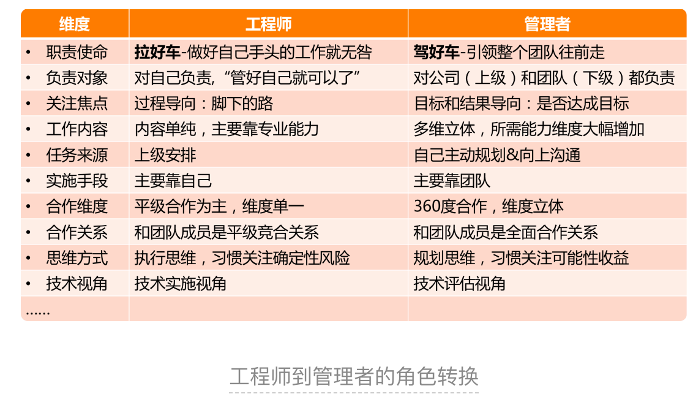

```
至此，六类管理误区我就分享完毕了，你是否能够在实际的管理工作中一眼认出它们呢？
我们再来回顾一下这六类误区都是什么：
第一类：过程导向、被动执行；
第二类：大包大揽、唯我最强；
第三类：带头大哥、当家保姆；
第四类：单一视角、固化思维；
第五类：自扫门前雪、固守边界；
第六类：患得患失。
```

```azure
我们把管理规划拆解为四个最核心的要素来着手操作，分别是:    
职能，关于团队是干什么的  
目标，关于要带团队去哪里;  
团队，关于依靠谁去达成目标;    
路径，关于走哪条路以及投入哪些资源    
这就涉及到目标设定的原则，即“SMART”原则。分别对应着 5 个英文单词，即 Specific、Measurable、Attainable、Relevant 和 Time-bound，用中文来说就是目标的明确性、可衡量性、可达性、相关性和时限性。
```
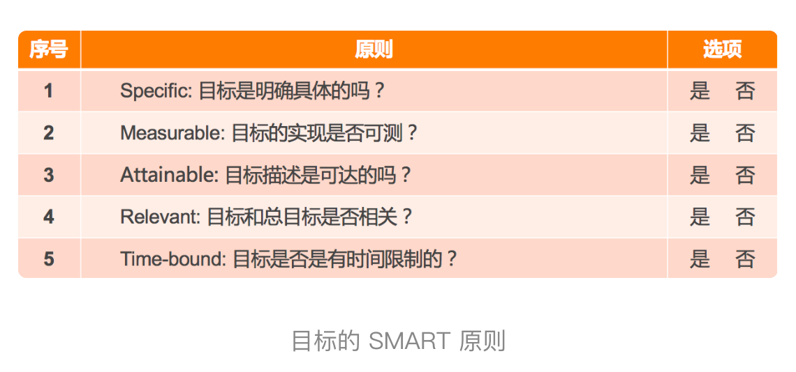

* **你通过对团队目标的驾驭，除了取得出色的业绩之外，还能打造出一个充满自驱力和凝聚力的高效执行的团队。**


* 团队建设三个视角  
  * 第一个视角是看团队目标； 
  * 第二个视角是看资源；  
  * 第三个视角是看人才培养
  * 以上的三个意识如果你都具备，能够从资源丰富性、手段多样性和人才持续性来预算你的资源，说明你已经是一位老道的管理者了

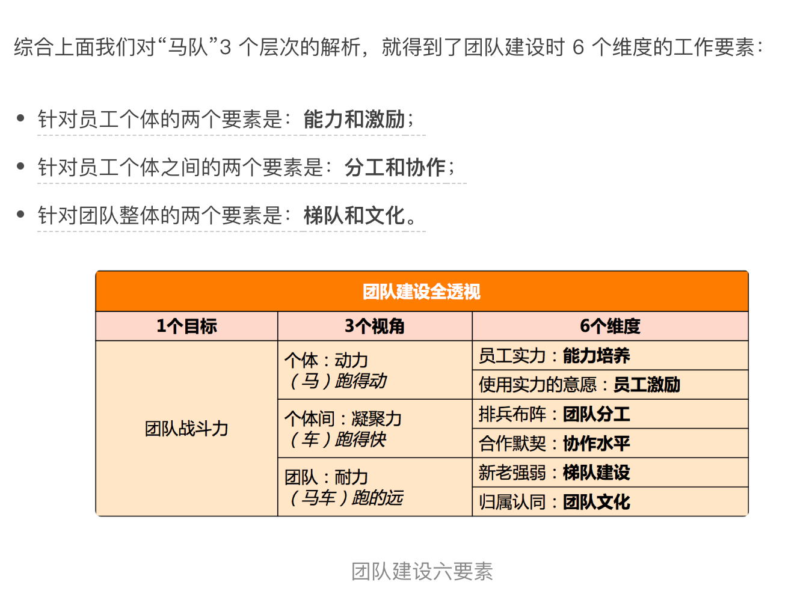

* 作为管理者，你应该如何激发员工学习的动力和意愿呢？大体上可总结为如下三板斧：“推”“拉”“放手”。

* 关于提升员工的能力，有两个信念特别重要。  
  * 第一是相信员工能力的差异性。即看到差异，重视丰富性。在工业时代，整齐划一、严格服从是团队管理的哲学；而在知识经济时代，员工的创造力能为团队带来更大的价值。创造力往往来源于差异的碰撞，所以作为管理者，你要特别关注能力的丰富性，标准不能太单一。  
  * 第二是相信团队能力的系统性。即欣赏差异，重视互补性。员工能力的差异，往往是他们对于团队的独特价值所在，管理者就是要像一位音乐指挥家一样，把各种优势各异的人统筹在一起，演奏出美妙的乐章。正如优势理论中所说的，所谓完美的团队，就是价值观相同，优势互补的团队。所以，作为管理者，你要看到团队能力的系统性，不要把各个员工的能力割裂来看。  

  
* 驱动力3.0 + 全面可持续幸福模型
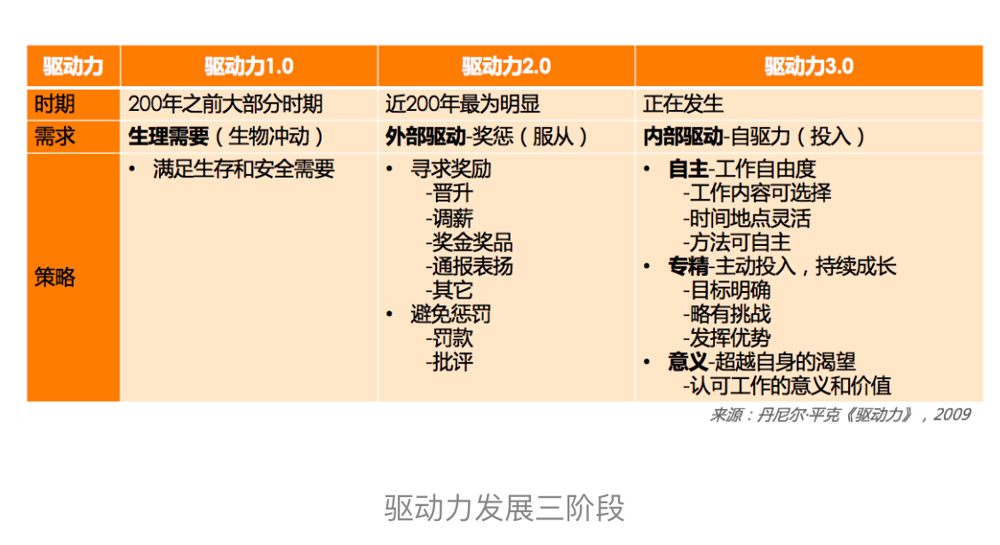
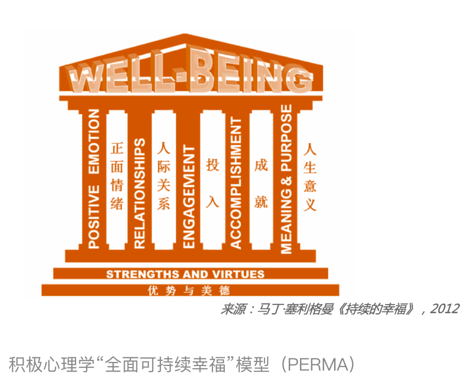

  
* 个体战斗力 = 个体能力 * 个体意愿
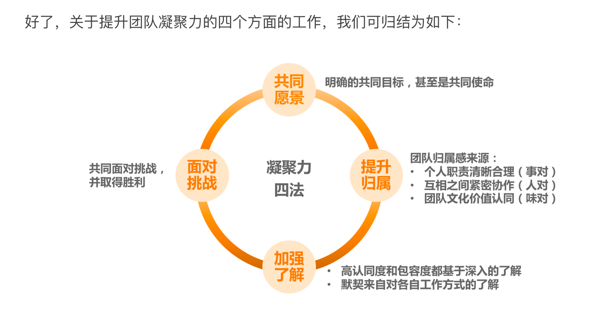

```azure
提升一个团队的耐力和韧劲，有两个要素：梯队培养和团队文化。  
一个团队的梯队，就好像一个团队的“骨架子”，这“骨架子”是否健康良好，决定了团队是否健壮。  
而团队文化就好像是团队的气质和调性，它会吸引“气味相投”的人持续加入，而把不符合团队气质的人筛选出去，越来越鲜明的团队价值观让大家紧密地聚拢在一起，从而让团队越来越“结实”，越来越“经得起折腾”，不断增强团队的耐力和韧劲。
```

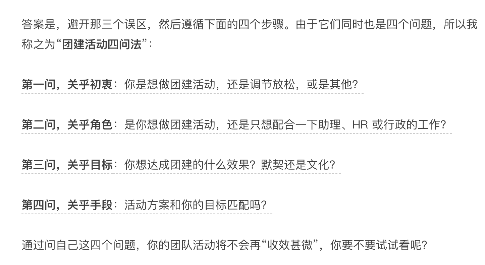

* 团队梯度+流程机制，让任务高效执行（紧急重要四象限评估事情的轻重缓急）

* “3F”倾听的沟通层次图

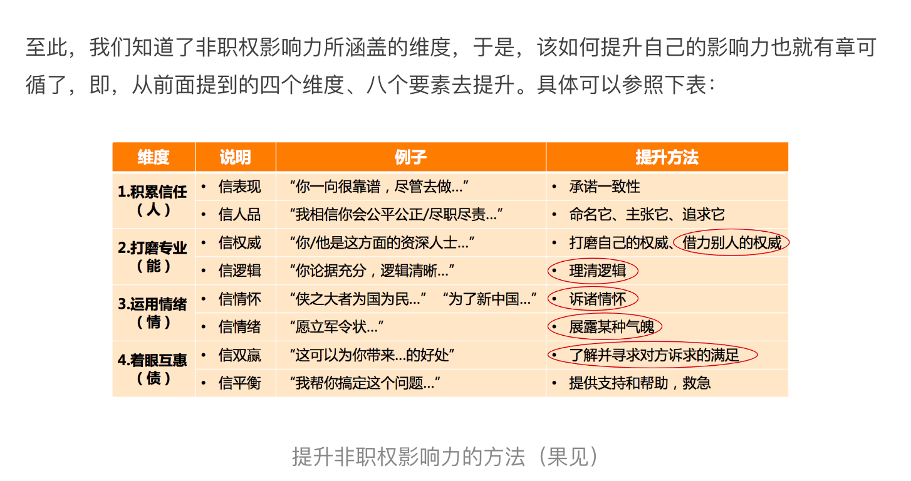

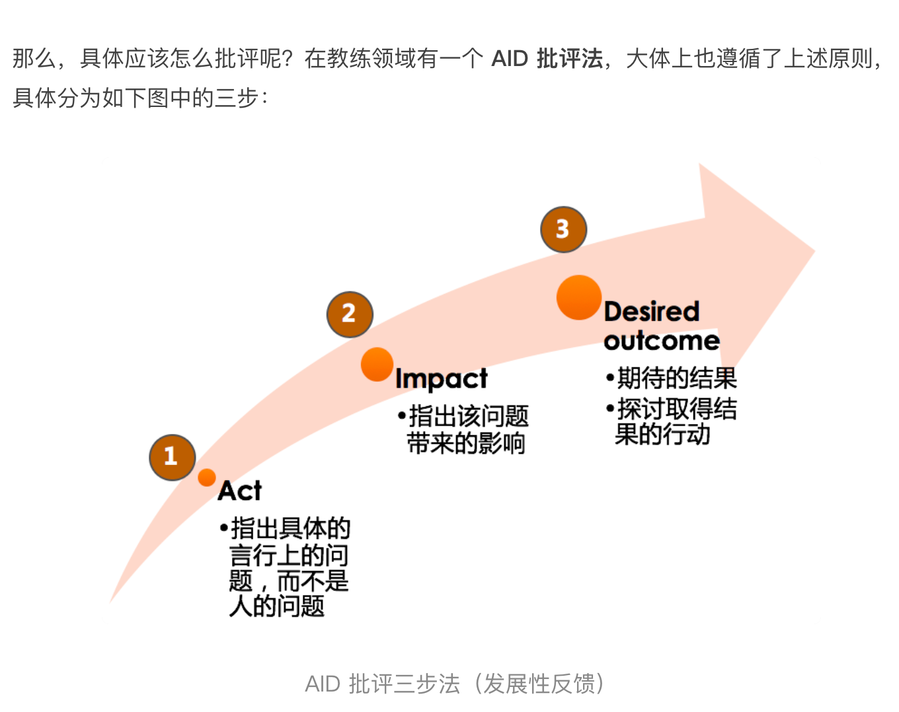

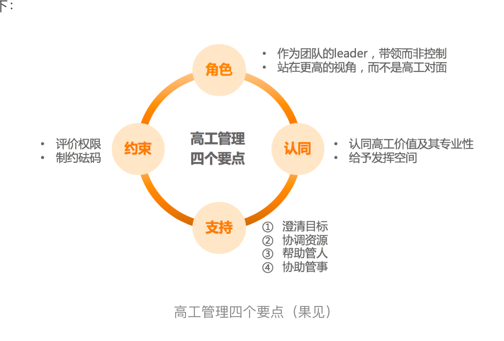

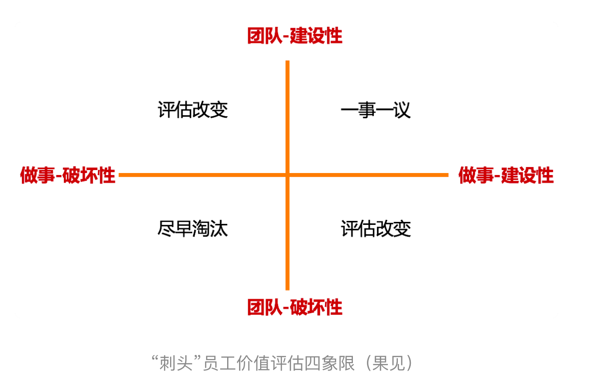

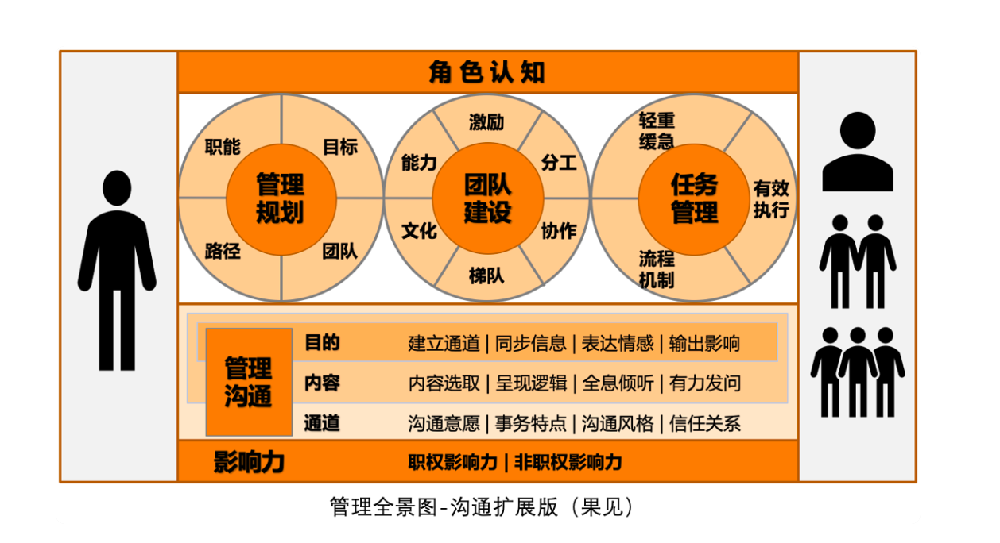

-------

管理
* 1、为什么离职  
业务：成熟期->系统稳定->公司暂无较大的动作，我对系统的掌握程度算是非常资深了，该做的优化也做得差不多了，业务就正常推进就行  
个人：在技术上比较难做出突破了；我年纪还不算很大，还比较想做点事情，而我是比较爱折腾的一类  
当然也免不了俗，就是薪水问题，也希望能找到一份收入更高的工作。  


* 2、现在的团队  
24人，两个BE组12人，一个前端组8人，一个QA组4，多的时候有30多人


* 3、现在的业务  
DP业务：话费流量充值，账单缴费，OTA包括酒店、机票、火车等，还有电影
本地生活：团购券，评价系统  
业务规模：gmv 800w， dau 230w+， buyer：130w+； 大促曾经最多时，一天1000w+订单  
系统规模：最高qps 2w+; 做过秒杀系统，订单蓄洪池； cpu 1000多核


* 4、日常工作有哪些  
项目管理：目标->过程->质量。需求排期、项目进度推进、项目质量管理、跨团队协调工作  
团队管理：中长期规划、团队成员盘点、团队人效盘点、团队成员成长计划、团队氛围建设  
技术管理：技术选型和调研、中大型项目方案评审、线上事故复盘、北极星指标


* 5、日常时间管理    
项目管理50%；技术管理30%；团队管理：20%  


* 6、怎么在繁忙的工作中提升自己  
转变学习方式：从自己学变成让他人教，从实现某个技术转变为选择某项技术，多和公司/业界大牛交流, 抓大放小


* 7、怎么培养团队成员  
成员优劣势摸底，针对不同人员成长计划；  
组织技术沙龙、读书分享  
勇于放权，让团队成员去主导一个项目（抓大放小）  

  
* 8、怎么做团队氛围建设  
建立信任、默契（吃饭、1v1、聊家常、关心、倾听、主动）  
高效、谦逊  


* 9、如果有一个项目很紧急，资源有限，怎么办   
    * 1、最有效的是先去争取能争取到的所资源（人、钱、时间等都是资源）
    * 2、项目动员大会，明确项目的重要性，明确每个人在项目中的作用和职责，让每个人都感觉到被重用  
    * 3、绩效鼓励  
    * 4、加班 -> 加班也无法完成，则砍掉低优需求  


* 10、怎么做团队规划  
    * 1、了解公司战略方向，团队内的业务需求和技术需求，尽量能和公司的战略方向保持统一  
    * 2、了解业界实时动态，不要什么事情都自己想当然的做，很多东西前人已经有很多经验可参考了  
    * 3、对自己业务的终极形态，有一个相对清晰的认知，所做的规划，都是希望业务能朝着这个终极形态去演进（浏览器的终极形态）  


* 11、你认为管理团队最重要的技能是什么
  * 1、硬实力：过硬的技术能力（能给团队以方向性指导，创造性的改革，能提效，能提高产研质量）  
  * 2、软实力：比较强的沟通技巧（对不同的人、不同角色、不同场合都要能游刃有余），沟通不是说一定要说很多，沟通中最重要的一个技能是倾听  


* 12、你入职后打算怎么做
  * 1、了解业务现状（找PM、找上级、找平级、找下属）  
  * 2、了解系统架构（看文档，找团队成员同步背景）  
  * 3、了解团队成员（从leader、核心成员、技术骨干进行1v1）  
  * 4、参与和融入（重要会议、方案评审、问题讨论、痛点搜集等）  
  * 5、规划（有一定了解之后，才敢谈规划）  


* 13、你觉得你凭什么能胜任这个岗位、你的优点和缺点？  
  * 1、年轻有活力  
  * 2、前后端经验、管理经验  
  * 3、高并发、高可用分布式系统架构经验  

  
* 14、你对加班怎么看  
  * 1、提倡高效工作，提倡有效工作时间  
  * 2、怎么评估有效工作时间：从结果评估，需求个数、需求质量、需求难度、提出建设性意见  
  

* 15、你在shopee最自豪的一件事是什么  
  * 我的上一个团队，本地生活，对我的认可度达到了前所未有的高度，凝聚力非常高；在shopee5年三次晋升也是我觉得很自豪的一件事
  * 当然这也是我很遗憾的一件事，共事时间太短，没来得及带领大家一起做出更辉煌、更有成就感的事情  

* 技术
  * 1、你对浏览器开发了解多少
    * 前端：
    > web标准的实现(多媒体支持、视频图片文件展示、动画、GPU优化、网络优化、支持不同平台，流畅度)
    安全（用户隐私，缓存）
    性能（内存、gpu、cpu、耗电量、页面加载等）
    拓展：支持插件
    
    * 后端：
    > 搜索引擎：
    我做过检索，但是主要是站内检索，但是浏览器不同，浏览器是全网检索，比站内检索的难度还是要高很多的，我想这也是对我的一个新挑战。
    搜索系统4大评价指标解析： 如何衡量和提升搜索指标？
    https://www.processon.com/view/66797e377ff9ca3b96287583